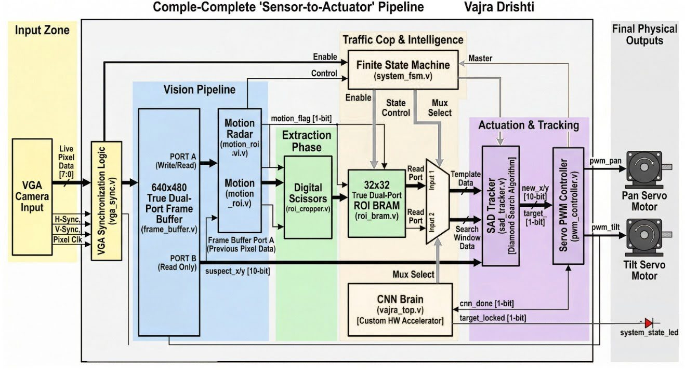
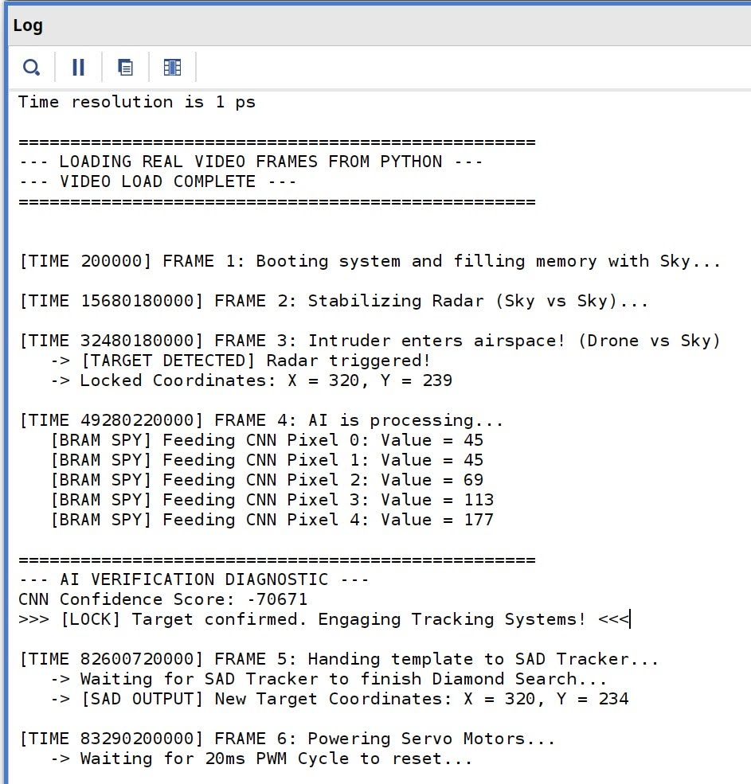
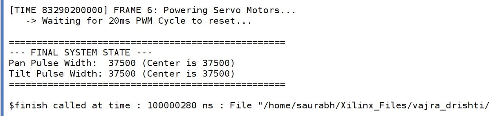

# The Drishti Framework: Autonomous Target Tracking System
**Hardware-Accelerated CNN & Autonomous Target Tracking System on FPGA**

## Abstract
The rapid proliferation of asymmetric drone threats necessitates instantaneous, edge-based defense mechanisms. However, contemporary autonomous tracking systems rely heavily on software-driven computer vision pipelines and external GPUs, introducing critical processing latency, high power dependencies, and operating system vulnerabilities. There remains a distinct gap for open, deeply optimized, bare-metal architectures that unify artificial intelligence and robotic tracking without external memory bottlenecks. 

Project Vajra Drishti addresses this by engineering a fully autonomous, hardware-accelerated detection and tracking pipeline directly into silicon. Synthesized entirely at the Register-Transfer Level (RTL) without third-party IP cores, the architecture integrates a custom Convolutional Neural Network (CNN) for threat verification with a Sum of Absolute Differences (SAD) algorithm for deterministic Pan/Tilt servo actuation. By resolving structural hazards through dynamic dual-port BRAM multiplexing, the system achieves a 1-cycle latency vision pipeline operating natively at 25 MHz. Comprehensive behavioral simulations successfully verified the closed-loop sensor-to-actuator datapath. Post-implementation analysis on the advanced Xilinx Kria K24I System-on-Module (SOM) yielded a highly optimized logic footprint—utilizing just 3.84% of available LUTs and 35.19% of BRAM—with an estimated on-chip power consumption of 17.275 W. These results prove that complex AI verification and kinematic tracking can be entirely decoupled from heavy software infrastructure, delivering a highly scalable, microsecond-latency blueprint for the future of localized airspace security.

---

## System Architecture

The system is divided into four distinct hardware phases:
1. **Vision Pipeline:** Synchronizes VGA camera input and utilizes background subtraction to detect motion coordinates.
2. **Extraction (ROI):** Crops a 32x32 pixel bounding box around the suspected target and stores it in dual-port BRAM.
3. **AI Verification:** A custom CNN processes the BRAM data to calculate a mathematical confidence score against a quantized threshold.
4. **Actuation & Tracking:** A Diamond Search SAD algorithm continuously locates the target in subsequent frames, while a deadzone-calibrated PWM controller drives physical servos.

---

## Intelligence Engine (Bare-Metal CNN)

The architecture utilizes a custom Quantized Convolutional Neural Network (CNN). Threat classification is achieved through a custom, deterministic hardware thresholding mechanism, bypassing the need for complex Softmax layers by immediately locking the target when the raw mathematical sum exceeds a -150,000 quantized boundary.

---

## Kinematic Tracking (SAD & PWM)

Once a target is locked, the SAD Tracker executes a 5-point Diamond Search algorithm to find the exact new coordinates of the drone in the live frame. The PWM Controller receives the active target coordinates, applies internal DEADZONE logic to ensure stability, calculates the 20ms pulse widths, and drives the physical pins.

---

## Hardware Specifications & Utilization

The architecture was physically synthesized and implemented on the advanced Xilinx Kria K24I System-on-Module (SOM).

* **Native Operating Frequency:** 25 MHz
* **Look-Up Tables (LUTs):** 2,709 (3.84% Utilization)
* **Flip-Flops (FF):** 964 (0.68% Utilization)
* **Block RAM (BRAM):** 76 Tiles (35.19% Utilization)
* **DSP Slices:** 2 (0.56% Utilization)
* **Estimated On-Chip Power:** 17.275 W

---

## Verification & Behavioral Simulation

The architecture was verified using a bottom-up methodology. 27 distinct testbenches were engineered, ensuring every individual component was mathematically flawless before system integration.

**System Test (`vajra_drishti_ultimate_tb.v`):** The ultimate behavioral verification sequentially feeds real Python-generated hexadecimal video frames into the hardware memory array to simulate a live combat scenario across multiple VGA frames.

### System Execution Log (Vivado TCL Console)

To further validate the deterministic nature of the hardware, the testbench outputs a cycle-accurate execution log to the Vivado TCL console. This log tracks the master Finite State Machine (FSM) as it autonomously routes data through the pipeline without any software intervention.

**Key Execution Milestones Demonstrated:**
* **Frame 3 (Detection):** The hardware radar successfully isolates a moving anomaly against the stabilized background, locking the initial bounding box coordinates (`X=320, Y=239`).
* **Frame 4 (AI Verification):** The custom CNN accelerator takes over the memory bus, processes the extracted pixels, and calculates a deterministic confidence score (`-70671`). Because this exceeds the quantized threshold, it successfully engages the `[LOCK]` state.
* **Frame 5 & 6 (Tracking & Actuation):** Control is handed to the SAD tracker, which recalculates the drone's spatial displacement (`X=320, Y=234`) and pushes the data to the PWM controllers to adjust the servo pulse widths.

