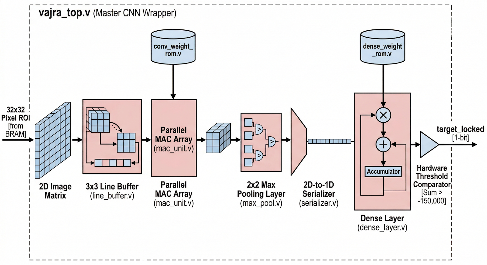
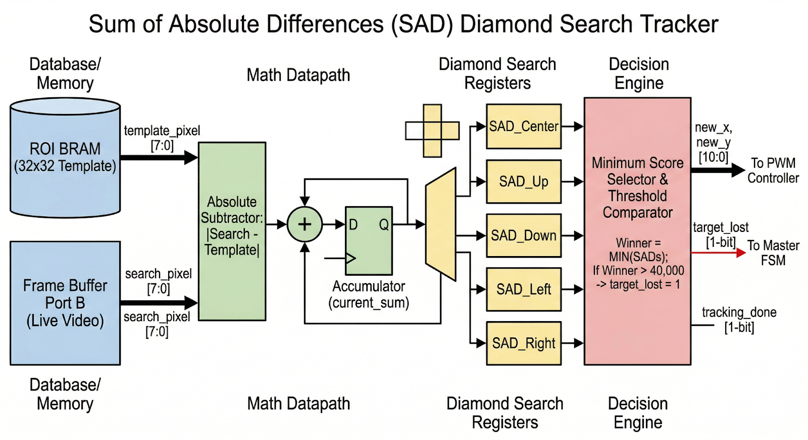
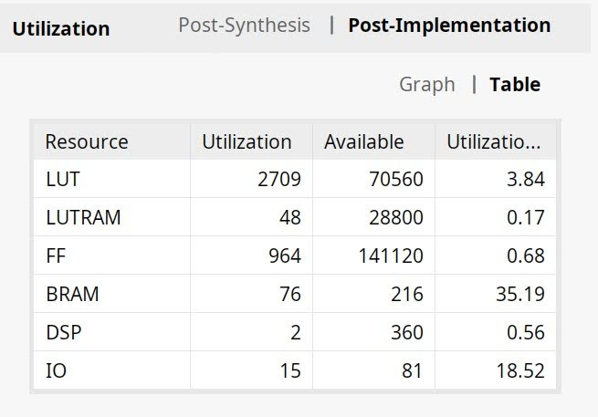
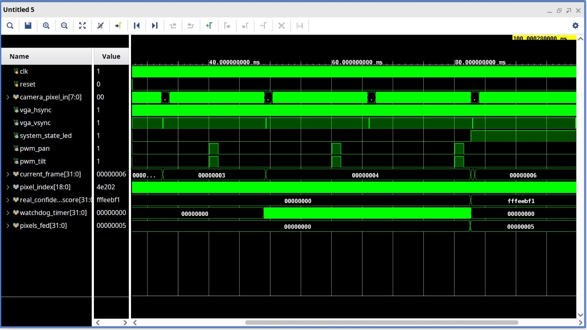

# The Drishti Framework: Autonomous Target Tracking System
[cite_start]**Hardware-Accelerated CNN & Autonomous Target Tracking System on FPGA** [cite: 7]

## Abstract
[cite_start]The rapid proliferation of asymmetric drone threats necessitates instantaneous, edge-based defense mechanisms. [cite: 12] [cite_start]However, contemporary autonomous tracking systems rely heavily on software-driven computer vision pipelines and external GPUs, introducing critical processing latency, high power dependencies, and operating system vulnerabilities. [cite: 13] [cite_start]There remains a distinct gap for open, deeply optimized, bare-metal architectures that unify artificial intelligence and robotic tracking without external memory bottlenecks. [cite: 14] 

[cite_start]Project Vajra Drishti addresses this by engineering a fully autonomous, hardware-accelerated detection and tracking pipeline directly into silicon. [cite: 15] [cite_start]Synthesized entirely at the Register-Transfer Level (RTL) without third-party IP cores, the architecture integrates a custom Convolutional Neural Network (CNN) for threat verification with a Sum of Absolute Differences (SAD) algorithm for deterministic Pan/Tilt servo actuation. [cite: 16] [cite_start]By resolving structural hazards through dynamic dual-port BRAM multiplexing, the system achieves a 1-cycle latency vision pipeline operating natively at 25 MHz. [cite: 17] Comprehensive behavioral simulations successfully verified the closed-loop sensor-to-actuator datapath. [cite_start]Post-implementation analysis on the advanced Xilinx Kria K24I System-on-Module (SOM) yielded a highly optimized logic footprint—utilizing just 3.84% of available LUTs and 35.19% of BRAM—with an estimated on-chip power consumption of 17.275 W. [cite: 18, 19, 20] [cite_start]These results prove that complex AI verification and kinematic tracking can be entirely decoupled from heavy software infrastructure, delivering a highly scalable, microsecond-latency blueprint for the future of localized airspace security. [cite: 20]

---

## System Architecture

[cite_start]The system is divided into four distinct hardware phases: [cite: 194]
1. [cite_start]**Vision Pipeline:** Synchronizes VGA camera input and utilizes background subtraction to detect motion coordinates. [cite: 195]
2. [cite_start]**Extraction (ROI):** Crops a 32x32 pixel bounding box around the suspected target and stores it in dual-port BRAM. [cite: 196]
3. [cite_start]**AI Verification:** A custom CNN processes the BRAM data to calculate a mathematical confidence score against a quantized threshold. [cite: 197]
4. [cite_start]**Actuation & Tracking:** A Diamond Search SAD algorithm continuously locates the target in subsequent frames, while a deadzone-calibrated PWM controller drives physical servos. [cite: 198]

---

## Intelligence Engine (Bare-Metal CNN)

[cite_start]The architecture utilizes a custom Quantized Convolutional Neural Network (CNN). [cite: 113] [cite_start]Threat classification is achieved through a custom, deterministic hardware thresholding mechanism, bypassing the need for complex Softmax layers by immediately locking the target when the raw mathematical sum exceeds a -150,000 quantized boundary. [cite: 68]

---

## Kinematic Tracking (SAD & PWM)

[cite_start]Once a target is locked, the SAD Tracker executes a 5-point Diamond Search algorithm to find the exact new coordinates of the drone in the live frame. [cite: 363, 499] [cite_start]The PWM Controller receives the active target coordinates, applies internal DEADZONE logic to ensure stability, calculates the 20ms pulse widths, and drives the physical pins. [cite: 364, 365]

---

## Hardware Specifications & Utilization

[cite_start]The architecture was physically synthesized and implemented on the advanced Xilinx Kria K24I System-on-Module (SOM). [cite: 742]

* [cite_start]**Native Operating Frequency:** 25 MHz [cite: 748, 757]
* [cite_start]**Look-Up Tables (LUTs):** 2,709 (3.84% Utilization) [cite: 751]
* [cite_start]**Flip-Flops (FF):** 964 (0.68% Utilization) [cite: 752]
* [cite_start]**Block RAM (BRAM):** 76 Tiles (35.19% Utilization) [cite: 754]
* [cite_start]**DSP Slices:** 2 (0.56% Utilization) [cite: 753]
* [cite_start]**Estimated On-Chip Power:** 17.275 W [cite: 759]

---

## Verification & Behavioral Simulation

The architecture was verified using a bottom-up methodology. [cite_start]27 distinct testbenches were engineered, ensuring every individual component was mathematically flawless before system integration. [cite: 532]

[cite_start]**System Test (`vajra_drishti_ultimate_tb.v`):** The ultimate behavioral verification sequentially feeds real Python-generated hexadecimal video frames into the hardware memory array to simulate a live combat scenario across multiple VGA frames. [cite: 535]

